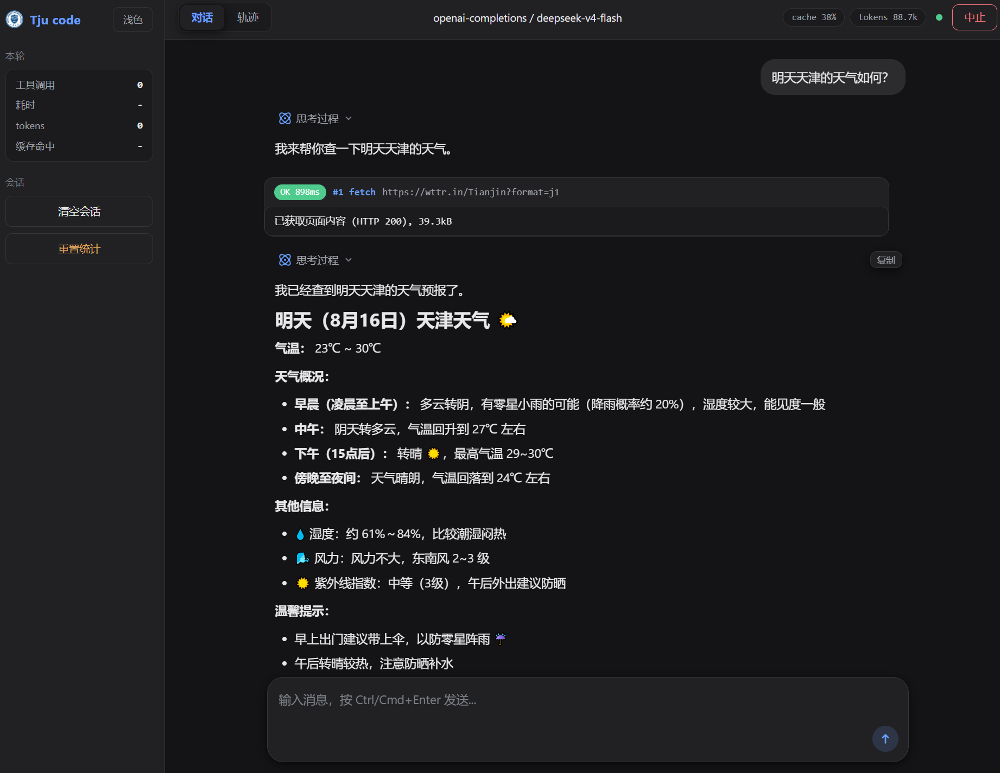
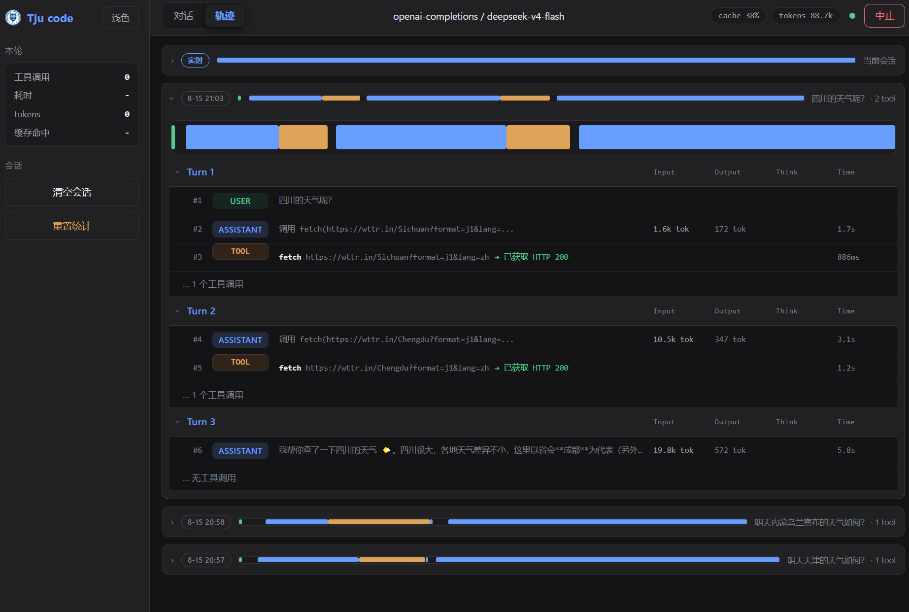

# Tju code 编程智能体工具

由天津大学系统安全与可信计算研究中心内部自研的 coding agent 工具，参考借鉴开源工具 `pi` 的架构与`opencode`的执行质量设计，目标是：省 token、高缓存命中率、可靠的工具调用。





## 特性

- 双层 agent 循环（外层 turn 循环 + 内层 provider 流式读取），天然适配流式 UI。
- 统一 AI 层：OpenAI 兼容（chat/completions）与 Anthropic Messages，SSE 流式解析。
- 内建工具集：`read` / `bash` / `edit` / `write` / `apply_patch` / `grep` / `fetch` / `scan` + 会话级 `todowrite` 计划工具 + `task` 子代理委托，参数用 zod schema 校验。
- 可靠执行：工具参数 JSON 非法或输出被截断的 tool call 一律不执行并要求重发；write 原子写、read 行数截断、edit 失败附带上下文、apply_patch 一次调用跨多文件顺序增改删（失败时列出已应用操作）、Windows bash 进程树清理、bash 报"命令未识别"时附等价替代提示、fetch 限流/截断/超时/中止。
- 联网查询体验：`fetch` 联网时 CLI/GUI 显示【正在联网查询中】与完成状态，不直接回显网页原始 HTML；抓取内容交由 AI 提取关键信息后以摘要/回答形式呈现给用户。
- 内建安全扫描：`scan` 工具做密钥泄露检查（API key / token / 私钥等常见模式）与依赖漏洞检查（`npm audit` 联网查，离线降级内置高危名单）；write/edit 后自动追加安全提示，把检查"左移"到编码阶段。
- 高可用：provider 瞬时错误（429/5xx/网络）指数退避自动重试；provider 报 context 溢出时自动强制压缩并重试一次；**SSE 流停滞超时**——provider 中途沉默 120s 即报错、不再无限挂起；任一 hook 抛错不打断整轮。
- 复杂任务韧性：多步任务用 `todowrite` 先列计划再逐步勾选（清单经工具结果留在会话中，GUI 以 `- [~] 内容 (high)` 可视化）；**`task` 子代理委托**——把自包含子任务委托给有界嵌套 agent（独立上下文、默认 5 轮、结果摘要回传），主会话保持精简，复杂任务无需拉高 `--max-turns`（默认 50 即可）；**自动纠偏**——检测到重复调用同一工具（≥3 次）或整轮空转时，注入一次纠偏提示拉回主线（`afterTurn` hook，可自定义）；撞上轮数上限时，最后收尾轮禁用工具并强制模型给出「已完成 / 未完成任务 / 下一步建议」的结构化交接说明。系统提示词已引导：审阅整个目录/模块、全量审计等大块独立工作用 `task` 拆解，避免主对话被细节撑爆。
- 上下文与缓存：`transformContext` 接入 `compactTranscript`，超预算时用 LLM 生成结构化 `<conversation-checkpoint>` 摘要（Objective / Work State / Next Move 等）保留工作记忆，已有摘要时增量合并，失败回退保守裁剪；预算内不动前缀以保持缓存命中；usage 记录缓存读/写，`/status` 展示命中率。
- 端点穿插 hooks：`transformContext`（上下文压缩/截断/注入的入口）、`beforeToolCall` / `afterToolCall`、`getSteeringMessages` / `getFollowUpMessages`。
- 两种界面：
  - CLI `chat`：终端交互会话。
  - GUI `gui`：本地 HTTP + SSE 服务器 + 浏览器界面（默认 `http://localhost:9399`），内置「对话 / 轨迹」双页签，轨迹页签可视化每次 run 的工具调用与耗时（见下文「GUI 轨迹功能」）。
- **GUI 插件系统**：`plugins/` 目录下的插件会被自动扫描加载，零侵入主项目代码。当前内建 `pet` 桌宠插件（见下文「桌宠插件」）。

## 快速开始

要求：Node >= 20。

推荐：
- Node 20-22 之间。

### 初始化环境依赖
```bash
npm install
```

### 界面

- `chat`：终端交互会话（默认命令）。
- `gui`：浏览器界面，默认打开 `http://localhost:9399`（`--no-open` 可禁止自动打开浏览器，`--port` 改端口）。

> 安全说明：GUI 服务绑定本机 127.0.0.1。启动时会生成一个随机会话 token 注入前端页面，所有 `/api/*` 请求需携带该 token（浏览器自动带），并校验同源 Origin，跨站网页无法伪造请求（防 CSRF / 本地 RCE）。token 会打印在启动日志中，供非浏览器客户端调用 API 时使用。

## 操作说明

### 方式一：用内置厂商预设（推荐）

预设已配好接口地址与默认模型，只要设置对应的 API key：

| 预设 | 接口地址 | 默认模型 | API key 环境变量 |
| --- | --- | --- | --- |
| `deepseek` | https://api.deepseek.com | `deepseek-v4-flash` | `DEEPSEEK_API_KEY` |
| `kimi` | https://api.moonshot.cn/v1 | `moonshot-v1-8k` | `MOONSHOT_API_KEY` |
| `qwen` | https://dashscope.aliyuncs.com/compatible-mode/v1 | `qwen-max` | `DASHSCOPE_API_KEY` |
| `glm` | https://open.bigmodel.cn/api/paas/v4 | `glm-4-plus` | `ZHIPU_API_KEY` |
| `amd` | https://developer.amd.com.cn/radeon/api/v1 | `DeepSeek-V4-Flash` | `AI_API_KEY` |

AMD Cloud 还可通过 `AI_API_URL` 覆盖接口地址、`AI_MODEL` 覆盖模型名。

推荐使用`deepseek v4 flash 0731`。

Windows PowerShell：

```powershell
$env:DEEPSEEK_API_KEY = "sk-你的key"
npm run dev:gui -- --profile deepseek          # 浏览器界面
npm run dev -- --profile deepseek              # 终端聊天
```

bash：

```bash
export DEEPSEEK_API_KEY=sk-你的key
npm run dev:gui -- --profile deepseek
```

AMD Cloud 示例：

```powershell
$env:AI_API_KEY = "你的key"
npm run dev:gui -- --profile amd
```

```bash
export AI_API_KEY=你的key
npm run dev -- --profile amd
```

预设的参数都可单独覆盖，例如换更强的模型：

```bash
npm run dev -- --profile deepseek --model deepseek-v4-pro
```

### 方式二：手动指定（任意 OpenAI 兼容接口）

`--api-key` / `--base-url` / `--model` 三件套直接给：

```powershell
npm run dev:gui -- --api-key sk-你的key --base-url https://api.deepseek.com --model deepseek-v4-flash
```

注意：`--base-url` 需要与 OpenAI 兼容格式匹配，程序会拼上 `/chat/completions`（如 DeepSeek 传 `https://api.deepseek.com`，Moonshot 传 `https://api.moonshot.cn/v1`）。Anthropic 接口切 `--api anthropic-messages`，走 `/v1/messages`。

#### 预设 + 自定义接口（中转站 / 私有部署）

保留厂商预设的其它默认，只替换接口地址、模型名、key：

```powershell
npm run dev -- `
  --profile deepseek `
  --base-url https://你的网关地址 `
  --model 你的模型名 `
  --api-key sk-你的key
```

同名 flag 优先于环境变量。也可以只用环境变量覆盖预设（切换 base-url 之后需重启进程才生效）：

| 预设 | API key | 可覆盖的 base-url 环境变量 | 模型名覆盖 |
| --- | --- | --- | --- |
| `deepseek` | `DEEPSEEK_API_KEY` | `DEEPSEEK_BASE_URL` | 仅 `--model` |
| `kimi` | `MOONSHOT_API_KEY` | `MOONSHOT_BASE_URL` | 仅 `--model` |
| `qwen` | `DASHSCOPE_API_KEY` | `DASHSCOPE_BASE_URL` | 仅 `--model` |
| `glm` | `ZHIPU_API_KEY` | `ZHIPU_BASE_URL` | 仅 `--model` |
| `amd` | `AI_API_KEY` | `AI_API_URL` | `AI_MODEL` |

其中：AMD 支持全环境变量覆盖（接口/模型/key），其余预设的模型名只能通过 `--model` 修改。

### 方式三：环境变量

OpenAI 兼容接口用 `OPENAI_API_KEY` / `OPENAI_BASE_URL`，Anthropic 用 `ANTHROPIC_API_KEY` / `ANTHROPIC_BASE_URL`；厂商预设还有各自的 `<厂商>_API_KEY`（见上表）。

### 多工作项

CLI 与图形界面都支持**多个独立会话（工作项）**并存，持久化在 `~/.tju-code/works/`（每个工作项一个子目录，原子写入 `work-item.json`；可用 `--session-dir` 改变存储目录）。

**GUI**：左侧边栏「工作项」列表展示全部工作项的数量与名称，支持：

- **新建**（可命名，留空用「未命名工作项」）
- **点击切换**工作项
- 每项悬停后 **✎ 重命名** / **× 删除**

**CLI**：会话内命令：

| 命令 | 作用 |
| --- | --- |
| `/work` 或 `/work list` | 列出全部工作项（`*` 标当前） |
| `/work new` | 新建工作项并切过去 |
| `/work open <id>` | 打开指定工作项 |
| `/work rm <id>` | 删除工作项（活动项不能删） |

**每个工作项都是完整会话**（消息 + todo + 模型），并在**每轮结束后自动保存**（GUI 防抖 1.5s，退出时冲刷，运行中断/进程被杀也不丢对话）。启动自动恢复上次使用的工作项；运行中切换工作项会立即切换到该工作项的完整对话。工作项只保存会话，不包含 run 轨迹（轨迹可随时从「轨迹」页签回放）。

### 目录访问权限

工具（read / write / edit / grep / bash）首次访问**工作目录之外**的目录时，会向你确认授权，允许后该目录及子目录在当前会话内不再询问；拒绝则本次操作被阻止（模型会收到"未授权"的提示）。`fetch` 是纯网络工具，不读本地文件系统，不受目录权限限制。审批只识别**独立盘符路径**（如 `D:\...`），`redis://` / `https://` 等协议串不会被误判成 `s:\` / `p:\` 而误弹授权框。

- CLI：终端里输入 `y` 允许、`n` 拒绝。
- GUI：页面弹出"允许 / 拒绝"按钮。
- 工作目录内的读写不受影响，无需确认。

### 联网安全（fetch 的 SSRF 防护）

`fetch` 默认**拒绝访问非公网地址**（环回 `127.0.0.1`/`::1`、链路本地与云元数据 `169.254.x.x`、RFC1918 内网 `10/8` `172.16/12` `192.168/16`、CGNAT、多播等），解析域名后按解析出的 IP 逐一校验，防止模型被网页内容诱导去探测本机、内网或云元数据接口（如 `169.254.169.254`）。确需访问本地或内网服务时，在调用参数里显式传 `allowPrivate: true` 放行。

### 安全扫描

内建 `scan` 工具把安全检查"左移"到编码阶段：写代码时模型可主动调用，发现风险会在提交前被标记出来。

- **密钥扫描**：正则匹配常见敏感信息（OpenAI/Anthropic key、AWS Access Key、GitHub token、Slack token、Google API key、Stripe key、JWT、PEM 私钥、`api_key`/`secret`/`token`/`password` 赋值等），报告 `文件:行号` 与命中的类别。自动跳过 `node_modules` / `.git` / `dist` 等目录。
- **依赖漏洞检查**：调用 `npm audit --json` 联网查询依赖漏洞；离线或 npm 不可用时降级为内置已知高危包名单（lodash / minimist / glob-parent / nth-check / shell-quote）快查。
- **自动提示**：`write` / `edit` 成功后，工具结果末尾自动追加一行安全提醒，引导模型运行 `scan` 复核后再提交。

```powershell
node dist/cli.js --profile deepseek   # 会话里对模型说"扫描项目安全"即可
```

> 说明：`scan` 是内建工具，由模型在对话中触发；密钥扫描走工作目录，依赖扫描基于当前目录的 `package.json` / `package-lock.json`。

### 思考模式与推理强度

DeepSeek 等官方推荐开启思考模式，**默认开启**。开启后请求会附带 `thinking: { type: "enabled" }` 与 `reasoning_effort`（默认 `high`），编程能力显著提升。不需要时用 `--no-thinking` 关闭（CLI 默认强度仍为 `high`，不提供强度开关）。

```powershell
npm run dev -- --profile deepseek --no-thinking
```

CLI 在模型思考（未输出正文）时会显示一行灰色 `[思考中...]` 提示，不会展示思考内容；纯文本轮与 `--no-thinking` 下不出现。

**GUI** 在输入框上方提供「推理」分段控件，四档与官方 `reasoning_effort` 取值一致：

- `none`：关闭思考模式（请求发 `thinking: { type: "disabled" }`）；
- `low` / `high` / `max`：开启思考模式并指定强度，默认 `high`。

两个端点都能用：OpenAI 兼容端点直接发送 `reasoning_effort`；Anthropic 格式端点（如 `dashscope.aliyuncs.com/apps/anthropic`）用 `thinking.budget_tokens` 表达强度（`low` 2048 / `high` 16384 / `max` 32768，且始终小于 `max_tokens`），仅当模型或地址属于 DeepSeek 时额外发送 `output_config.effort`（该端点会忽略 `budget_tokens`），以免影响原生 Anthropic。

选择即时生效，并同时写入 `localStorage`（`tju.gui.effort`）与当前工作项：切换/重启后按工作项各自恢复。旧值 `minimal`/`medium`/`xhigh`/`ultra` 会自动归一到 `low`/`high`/`high`/`max`。

### GUI 发送方式与设置

右上角设置齿轮（⚙）打开设置弹窗，目前含一项：

- **Enter 发送**（默认关闭）：勾选后按 `Enter` 直接发送、`Shift+Enter` 换行；不勾选时按 `Ctrl`（macOS 为 `Cmd`）+ `Enter` 发送。选择即时生效并持久化到 `localStorage`（`tju.gui.enterSend`），输入框 placeholder 会同步提示当前快捷键。
- 中文输入法组合态（IME composing）下按 Enter 只确认候选词，不会误发送。

运行中的「停止」入口在**发送按钮本身**：运行期间发送按钮变为停止图标，点击即中止当前 run（不再单独设顶栏中止按钮）。

### GUI 轨迹功能

浏览器界面顶部栏有「对话 / 轨迹」两个页签，轨迹页签把每次运行（run）可视化为一组**横向轨迹条**，dsh 风格的事件溯源视图：

- **实时 run 在最上方**，历史 run 按时间倒序往下排；每条轨迹条头部 = caret + 时间徽标 + 迷你时间线 + 首条用户消息摘要 + 工具数，点击头部展开/收起。
- 展开后是**台账式分轮列表**：每轮一个可折叠区块（轮头 sticky），块内每行 = 全局序号 + 类型标签（USER 绿 / ASSISTANT 蓝 / TOOL 琥珀 pill）+ 文本 + 行尾指标列（Input / Output / Think / Time）。TOOL 行内联 `→ 结果`（运行中/成功/失败三色），ASSISTANT 报错显示红色 `→ 错误详情` 整行标红，纯工具调用的 ASSISTANT 行显示 `调用 工具名(参数)`。
- **点击任意轨迹行可展开完整详情**：行下方内联面板显示该行的完整参数与完整结果（TOOL）或完整文本（USER/ASSISTANT），可滚动、可复制；同一轮内同时只展开一行。完整内容取自内存（历史 run 经事件日志按需回放），页面存储仍只保留截断摘要，不放大本地存储。
- 概览条与迷你条为 Chrome 网络面板式时间线，颜色与台账一致，一眼看出每轮/每个工具调用占用多少时间。
- **右键历史 run 的头部**会弹出上下文菜单，可「删除该 run」，确认后连同其事件日志一并删除（实时 run 无菜单）。
- 轨迹数据全部来自 SSE AgentEvent，并持久化到 `localStorage`（`tju.gui.traj`）；刷新页面自动重建当前轨迹。历史 run 的事件日志落盘在 `~/.tju-code/logs`（`--log-dir` 可改，`--log-retention` 控制保留天数），刷新/重连时会回放已落盘事件，进行中的轨迹不丢失。事件日志读取走流式（`node:readline` 逐行），大 run 不整文件载入内存。
- **多工作项**：`~/.tju-code/works` 持久化每个工作项的完整会话（消息 + todo + 模型），启动自动恢复上次工作项；工作项在**每轮结束后自动保存**（防抖 1.5s，退出时冲刷），运行中断/进程被杀也不会丢对话；切换工作项时对话区按核心 transcript 重建——用户消息、思考+回答、以及按 `toolCallId` 配对的**工具块（参数+结果）**都会还原，不会丢失工具调用信息；历史 run 的完整轨迹仍可从「轨迹」页签回放。

### 桌宠插件（pet）

GUI 内建一个 Live2D 风格的桌宠，位于浏览器窗口右下角，随对话实时变化：

- **状态联动**：订阅 SSE AgentEvent 流，自动匹配当前工作状态——思考、读文件、写代码、敲终端、搜索、完成、出错等，每种状态对应不同表情精灵图。
- **表情动画**：12 秒 phase 轮换，工作/干饭交替，闲置 5 分钟打哈欠、15 分钟睡觉。
- **气泡文字**：头顶气泡显示当前状态标签与详情，流式输出时滚动展示，10 秒无活动自动隐藏。
- **交互**：鼠标拖拽移动位置，滚轮缩放（65%-140%），位置/缩放持久化到 localStorage。
- **可插拔**：放在 `plugins/pet/` 目录下，删除该目录即可完全移除，不影响主项目。

```
plugins/pet/
├── pet.js          # 插件入口（状态机 + 渲染 + 拖拽 + SSE 订阅）
└── assets/         # 30 个 WebP 精灵图（从 deepseek-pet-main 移植）
```

### CLI 命令

终端会话内可用斜杠命令（`/help` 查看完整说明）：

| 命令 | 作用 |
| --- | --- |
| `/exit` | 退出（若正在运行先终止） |
| `/clear` | 清空对话记录 |
| `/abort` | 取消当前一轮 |
| `/model <id>` | 热切换模型（下一轮生效），如 `/model deepseek-v4-pro` |
| `/status` | 显示模型、thinking 开关、消息数、token 与缓存命中 |
| `/work` | 工作项管理：`list` / `open <id>` / `new` / `rm <id>`（详见「多工作项」一节） |
| `/help` | 完整帮助 |

运行期间按 Ctrl+C：一次取消当轮，再按一次退出。

### 上下文与缓存

- 上下文默认预算 128K token（`--max-context-tokens <n>` 可调）。超出后自动用 LLM 把旧历史压缩为结构化 `<conversation-checkpoint>` 摘要（Objective / Important Details / Work State·Completed·Active·Blocked / Next Move / Relevant Files），保留最近约 8K token 原文，摘要落回会话以保持前缀缓存稳定；已有摘要时增量合并。摘要生成失败时回退为保守裁剪（超大单条截断 + 按整轮丢弃最旧 turn）。预算内完全不动，保证 DeepSeek 等前缀缓存的命中。
- 若 provider 因上下文超长拒绝请求（`context length` / `prompt is too long` 等），会自动强制压缩并重试一次，不再直接报错中断。
- 每个 assistant 消息的 `usage` 记录 `cacheRead`（命中）/ `cacheWrite`（写入），`/status` 展示累计命中数与命中率。

### 构建与验证

```bash
npm run build   # 产物 dist/，bin 指向 dist/cli.js
npm run typecheck
npm test
```

### 使用编译产物（dist/）

`npm run build` 后，`dist/` 里就是可直接发布的产物，两个入口：

- **CLI（dist/cli.js）**：不经过 tsx 直接跑编译后的命令，效果与 `npm run dev` 一致：

  ```powershell
  $env:DEEPSEEK_API_KEY = "sk-你的key"
  node dist/cli.js --profile deepseek          # 终端聊天
  node dist/cli.js gui --profile deepseek      # 浏览器界面
  node dist/cli.js --help                      # 查看全部参数
  ```

  想**全局安装**、在任意目录敲 `tju-code`：

  ```powershell
  npm link          # 把 dist/cli.js 注册为全局命令 tju-code
  tju-code --profile deepseek
  # 不再需要时：npm unlink tju-code
  ```

  换机器部署时，把 `dist\` 整个拷走即可（`start` 已把 `zod`/`zod-to-json-schema` 直接打进单文件，**自包含、无需安装依赖**；`dist\cli.js` 也带 shebang，可执行）。

   也可以直接用仓库根目录的**一键启动脚本**（脚本顶部 CONFIG 区直接填 API_KEY / BASE_URL / MODEL 等，无需设环境变量）：

   | 脚本 | 平台 | 用途 |
   | --- | --- | --- |
   | `启动-dist-gui.bat` | Windows | 浏览器 GUI（推荐） |
   | `启动-dist.bat` | Windows | 终端 chat |
   | `启动-dist-gui.sh` / `启动-dist.sh` | Linux/macOS | 浏览器 GUI / 终端 chat（`chmod +x` 后执行） |
   | `启动.bat` / `启动-gui.bat` | Windows | 自动检测 dist，缺失时回退 tsx 跑源码 |

   每个脚本顶部 CONFIG 区变量作用相同：

   | 变量 | 默认 | 说明 |
   | --- | --- | --- |
   | `API_KEY` | 空 | 你的 API Key（必填） |
   | `BASE_URL` | 空 | 接口地址（留空用默认，URL 含 `anthropic` 自动走 Anthropic 协议，否则 OpenAI） |
   | `MODEL` | 空 | 模型名（留空用默认） |
   | `WORKDIR` | 空 | 智能体的工作目录（留空 = 脚本所在目录） |
   | `PORT` | `9399` | GUI 端口（仅 gui 脚本） |

   > bat 脚本双击运行，结束/报错时会 `pause` 等待按键；路径含中文可正常使用（脚本已 `chcp 65001` 切 UTF-8）。

- **库（dist/index.js + index.d.ts）**：作为编程接口被其他项目引用。

  ```js
  // 本地相对导入：
  import { createAgent, runAgentLoop, PROVIDER_PROFILES } from "./dist/index.js";

  // 安装/ link 后按包名导入：
  // import { createAgent } from "tju-code";
  ```

  导出内容以 `dist/index.d.ts` 为准（`createAgent` / `Agent` / `runAgentLoop` / 工具工厂 / `PROVIDER_PROFILES` 等）。

> 注意：`dist/` 是独立打包的单文件，别把里面单个文件拆走单独使用；整包移动即可，无需依赖 `src/`。

## 命令与参数

```
tju-code [command] [flags]

Commands:
  chat   交互终端会话（默认）
  gui    浏览器 UI，http://localhost:9399（默认自动打开浏览器）
  version / help

Flags:
  --api <openai-completions|anthropic-messages>
  --profile <deepseek|kimi|qwen|glm|amd>
  --provider <id>     --model <id>
  --api-key <key>     --base-url <url>
  --no-thinking       关闭思考模式（默认开启）
  --max-tokens <n>    单次输出上限
  --max-context-tokens <n>  上下文预算（默认 128000，超出自动压缩）
  --max-turns <n>      每轮 run 的最大 turn 数（默认 50，超出强制收尾）
  --port <n>（gui）   --no-open
  --log-dir <path>     运行事件日志目录（默认 ~/.tju-code/logs）
  --log-retention <n>  事件日志保留天数（默认 7）
  --session-dir <path> 工作项持久化目录（默认 ~/.tju-code/works）
```

环境变量：`OPENAI_API_KEY` / `OPENAI_BASE_URL` / `ANTHROPIC_API_KEY` / `ANTHROPIC_BASE_URL`，厂商预设各自的 `<厂商>_API_KEY`，以及 AMD 的 `AI_API_KEY` / `AI_API_URL` / `AI_MODEL`。

## 架构

数据流：

```
CLI/GUI -> Agent (stateful) -> runAgentLoop -> ai layer (OpenAI/Anthropic adapter)
                                        -> EventStream<GroundEvent>
```

三层消息模型：

1. `GroundEvent` - AI 层产物：`start` / `thinking_delta` / `text_delta` / `toolcall_*` / `done | error`
2. `Message` - 核心层持久化消息：`UserMessage` / `AssistantMessage` / `ToolResultMessage`
3. `AgentEvent` - UI 事件：`message_*` / `turn_*` / `tool_*` / `agent_*`

核心类型与契约集中在 `src/core/types.ts`，AI 层契约在 `src/ai/types.ts`。

## 扩展点

- **添加 provider**：实现 `src/ai/types.ts` 的 `ProviderAdapter`（`api` + `stream`），在 `src/ai/index.ts` 注册。
- **自定义工具**：`src/core/types.ts` 的 `AgentTool`，用 `zod` 给出 `parameters` 即可被 `createAgent` 使用。
- **运行钩子**：见 `src/core/types.ts` 的 `AgentLoopConfig`，特别是 `transformContext`--上下文压缩/截断/注入的唯一入口（现接入 `compactTranscript`，LLM 结构化摘要压缩）。
- **GUI 插件**：在 `plugins/` 下创建子目录，放入 `pet.js` 入口文件，启动时自动扫描加载。插件通过 SSE 订阅 AgentEvent，可自由扩展 GUI 行为。

## 目录

```
src/
  ai/       统一 AI 层（openai / anthropic / sse / utils）
  core/     agent 运行时（agent / agent-loop / event-stream / types / tools）
  gui/      HTTP + SSE 服务器与内嵌前端
  cli/      chat 交互会话
  config/   create-agent -> CLI 组装
plugins/
  pet/      桌宠插件（纯前端，零侵入主项目）
```


## 研究机构

- 天津大学系统安全与可信计算研究中心